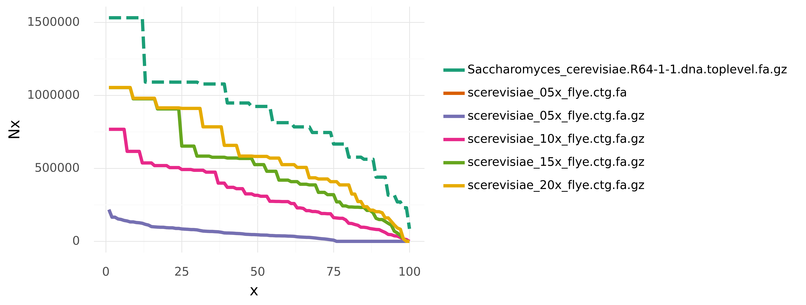
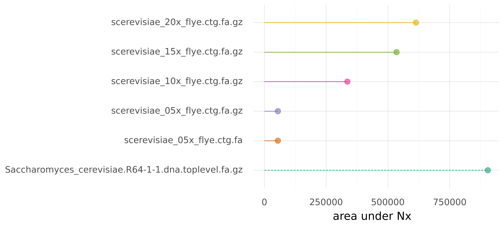

# pauNy


Nx curves and area-under-Nx metrics for python

This repository is based on [a blog post by Heng Li](https://lh3.github.io/2020/04/08/a-new-metric-on-assembly-contiguity) discussing 
a better metric than N50 to assess assembly contiguity.

N50 is often used to quantify the contiguity of assemblies. In general, Nx describes that contigs longer than Nx cover x% of an assembly.
An entire Nx curve shows Nx as a function of x, ranging from 0 to 100.
N50 is only a single value on this Nx curve, which is not equivalent to a median or average contig length. 
And it might hide some interesting insight about the total contiguity of an assembly.

 
Further, area under Nx (auN) is the sum of the area under such an Nx curve. It does not suffer from the same issues that can affect N50 (see linked blog post), 
and would therefore be a better measure for assembly contiguity. N50 is extremely popular though, but maybe introducing a simple python module called **p-auN-y** can make a difference? 

## Installation

Set up a virtual environment and install dependencies 

```shell
python3 -m venv pauny-venv
source pauny-venv/bin/activate
pip install numpy pandas plotnine
```

Clone the repository

```shell
git clone https://github.com/W-L/pauNy.git
```


## Quick usage

### Required args

Execute the runscript with input `-i / --input`, which can be fasta files of assemblies or one or more directories with fasta files in them. Files can be gzipped too.

### Optional args

- `-o / --out` can specify a base name for output files
- `-r / --ref` for a path to a reference assembly. This triggers calculation of NGx and auNG values using the genome size. And will also mark this assembly as reference in output.
- `-g / --genomesize` alternatively to a reference file, a genome size (estimate) can be given for scaling values to NGx and auNG.


```shell
usage: pauNy [-h] -i INPUT [INPUT ...] [-o OUT] [-r REF | -g GENOMESIZE]

Nx curves and area under Nx in python

optional arguments:
  -h, --help            show this help message and exit
  -i INPUT [INPUT ...], --input INPUT [INPUT ...]
                        input fasta file(s) or director(ies) of files. Can be multiple (space-separated).
  -o OUT, --out OUT     base name for output files
  -r REF, --ref REF     path to reference fasta file
  -g GENOMESIZE, --genomesize GENOMESIZE
                        genome size or estimate

```


## Use as python module

Instead of using the runscript, this module can be imported into other scripts as `import pauNy`. The main functionalities are:

```python
import pauNy
# for a single assembly fasta file
asm = pauNy.Assembly(path, [gsize])
nx_values = asm.calculate_Nx()
auN_value = asm.calculate_auN()

# for multiple assemblies
asm_c = pauNy.AssemblyCollection(paths, [reference_path, genome_size])
nx_dict, aun_dict = asm_c.calculate_metrics()
nx_frame, aun_frame = asm_c.generate_dataframes()   # dicts can be passed, otherwise they are recalculated
asm_c.metric_dataframes()                           # print metrics to file; as above dfs can be passed optionally 
asm_c.metric_plots()                                # generate visualisations (see example); as above dfs can be passed optionally
```

For documentation check out the docstrings and type hints in the sources.


## Example

As an example we can look at assemblies of yeast from different levels of subsampled coverage (5x, 10x, 15, 20x). These assemblies and a reference assembly are in `data/`.
You can reproduce the example csv-files and visualisations using:

```shell
./pauny.py -i data/ -r data/Saccharomyces_cerevisiae.R64-1-1.dna.toplevel.fa.gz
```







## Run tests

```shell
pip install coverage
coverage run -m unittest discover -s tests
coverage report
```


